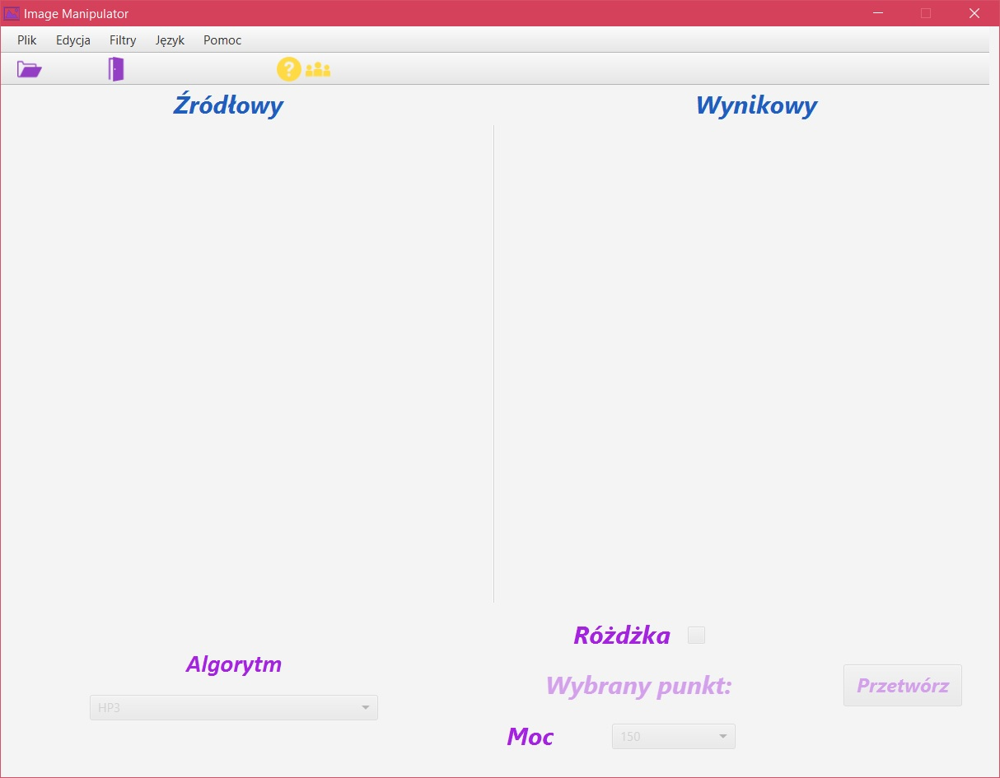
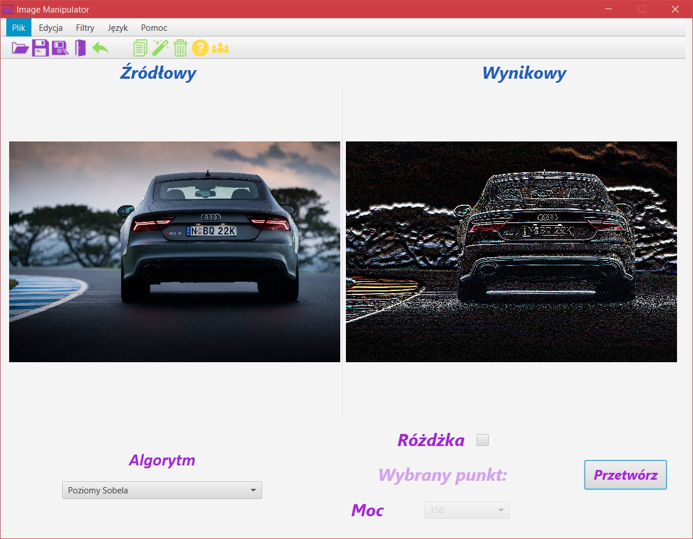
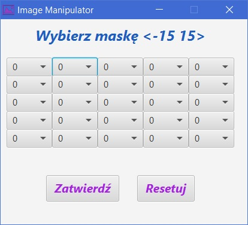
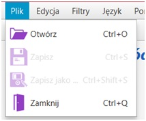
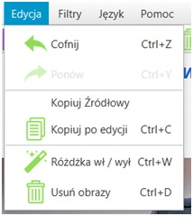
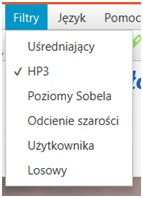
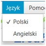
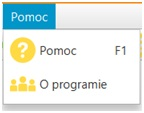
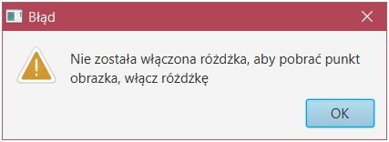
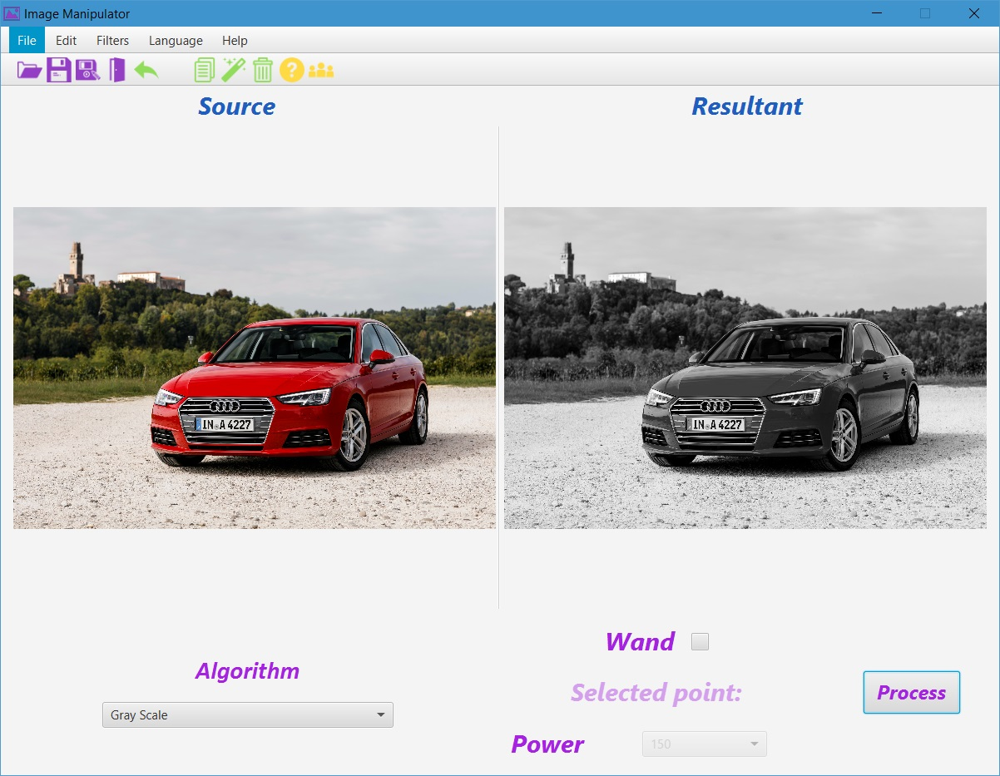

# [PL]
# Prosta aplikacja do przetwarzania obrazów

## Dostępnych jest kilka predefiniowanych filtrów, możliwość dodawania własnego, włączanie / wyłączenie różdżki, zmiana jej mocy.

 
*Aplikacja przed załadowaniem obrazka*

 
*Aplikacja po załadowaniu obrazka*

 
*Panel wyboru maski użytkownika*

 
*Wysuwane menu plik*

 
*Wysuwane menu edycja*

 
*Wysuwane menu filtry*

 
*Wysuwane menu języki*

 
*Wysuwane menu pomoc*

 
*Przykład zabezpieczenia aplikacji przed niepoprawnym użyciem*

# [EN]
# Simple Image Manipulator 

## There are several pre-defined filters, the ability to add your own, turn on / off the wand, change its power.

 
*App appearance after starting and loading the image*
